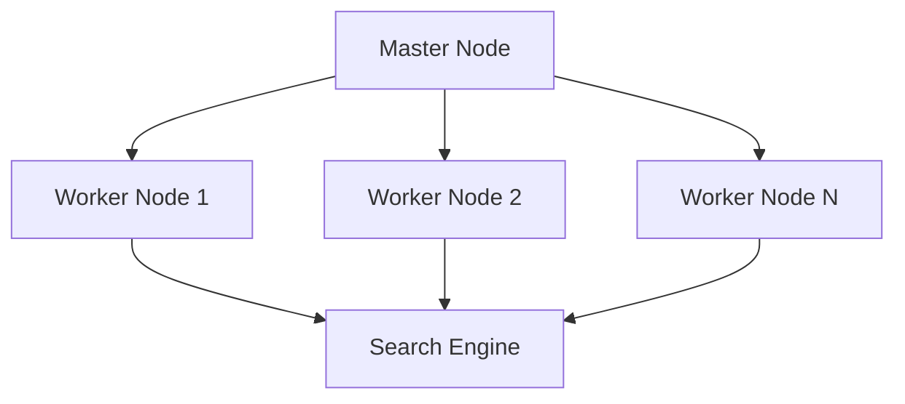

딥블루(Deep Blue)는 IBM이 1990년대에 개발한 체스 전용 슈퍼컴퓨터이다. 전통적인 인공 지능 접근법과 고성능 하드웨어를 결합하여 1997년 세계 체스 챔피언 가리 카스파로프(Garry Kasparov)를 이긴 최초의 컴퓨터로 알려져 있다. 이 승리는 인공 지능(AI) 연구와 인간‑컴퓨터 대결에 대한 인식을 크게 변화시켰다.

# 개발 배경

컴퓨터 체스는 1950년대부터 연구되어 왔으며, 1980년대 후반까지는 주로 소프트웨어 기반의 탐색 알고리즘에 의존했다. IBM은 이러한 흐름에 맞추어 1988년 캐나다 토론토 대학의 박사 과정 학생 허 펑시웅(Hu‑Feng Hsu)과 그의 팀이 만든 **ChipTest**를 시작점으로 딥블루 프로젝트를 시작했다[^1].

- **ChipTest**: VLSI(초고밀도 집적 회로) 기반의 체스 평가 모듈로, 초당 약 3백만 개의 포지션을 평가할 수 있었다.  
- **Deep Thought**: ChipTest를 확장한 차세대 시스템으로, 1991년 세계 체스 컴퓨터 대회에서 1위를 차지했다[^2].

IBM은 이러한 기술을 바탕으로 완전한 체스 전용 슈퍼컴퓨터를 구축하기 위해 **Deep Blue** 프로젝트를 1993년에 공식 발표했다.

# 시스템 구조 및 주요 사양

딥블루는 전통적인 CPU와 맞춤형 VLSI 체스 프로세서가 결합된 하이브리드 아키텍처를 채택했다. 주요 사양은 아래 표와 같다.

| 항목 | 사양 |
|------|------|
| **출시 연도** | 1996년 (첫 버전) |
| **프로세서** | 480개의 특수 설계 VLSI 체스 칩 (IBM PowerPC 기반) |
| **CPU** | IBM RS/6000 모델 590 (5,000 MHz) |
| **메모리** | 1.5 GB RAM |
| **초당 평가 포지션** | 200 M (1997년 버전) |
| **검색 깊이** | 평균 6~7수, 피크 12수 이상 |
| **소프트웨어** | 체스 전용 탐색 엔진, 평가 함수, 오프닝 북, 엔드게임 테이블베이스 |
| **무게** | 약 5톤 |

- **특수 체스 칩**: 각 칩은 체스 포지션 평가와 이동 생성에 최적화되어 있어, 일반 목적 CPU보다 수십 배 빠르게 동작한다.  
- **병렬 탐색**: 480개의 프로세서를 동시에 활용해 포지션 트리를 폭넓게 탐색했으며, 분산 트랜스포지션 테이블을 통해 중복 계산을 최소화했다.  
- **평가 함수**: 물리적 기물 가치 외에도 피스 활동성, 왕의 안전, 폰 구조, 중앙 통제 등 30여 개의 가중치를 고려했다[^3].

## 하드웨어 구성도

>   
> *딥블루의 주요 하드웨어 구성 요소* (출처: IBM)

# 1996년 대결: 가리 카스파로프와의 첫 경기

1996년 2월, 딥블루는 미국 뉴욕의 필드에서 카스파로프와 6번의 대국을 치렀다. 이때 딥블루는 최초 버전으로, 평균 초당 100 M 포지션을 평가할 수 있었다.

| 경기 | 승자 | 승점 |
|------|------|------|
| 1 | 카스파로프 | 1‑0 |
| 2 | 딥블루 | 0‑1 |
| 3 | 카스파로프 | 1‑0 |
| 4 | 카스파로프 | 1‑0 |
| 5 | 카스파로프 | 1‑0 |
| 6 | 카스파로프 | 1‑0 |

결과는 **딥블루 1승 5패**였으며, 카스파로프는 인간이 기계에게 패배할 가능성을 과소평가하지 말아야 함을 강조했다[^4].

이 경기에서 딥블루는 **전술적 깊이**와 **오프닝 준비**에서 인간에 비해 뒤처졌으며, 특히 복잡한 중간 게임에서 평가 오류를 보였다. 그러나 일부 경기에서는 카스파로프에게 예기치 못한 전술 실수를 강요하기도 했다.

# 1997년 재대결: 승리와 그 의미

1997년 5월, 딥블루는 개선된 하드웨어와 소프트웨어를 탑재한 **Deep Blue II**로 다시 카스파로프와 맞붙었다. 이번 버전은 초당 200 M 포지션을 평가할 수 있었으며, 오프닝 북과 엔드게임 테이블베이스가 크게 확장되었다[^5].

| 경기 | 승자 | 승점 |
|------|------|------|
| 1 | 딥블루 | 1‑0 |
| 2 | 카스파로프 | 0‑1 |
| 3 | 딥블루 | 1‑0 |
| 4 | 딥블루 | 1‑0 |
| 5 | 카스파로프 | 0‑1 |
| 6 | 딥블루 | 1‑0 |

**최종 결과**: 딥블루 3.5점, 카스파로프 2.5점, 딥블루가 승리[^6].

## 승리 요인

1. **검색 깊이**: 평균 검색 깊이가 6~7수에서 피크 12수로 확대되었다.  
2. **개선된 평가 함수**: 기물 교환, 장기 전략, 왕의 안전 등에 대한 가중치가 재조정되었다.  
3. **강화된 오프닝 북**: 30만 개 이상의 오프닝 라인을 포함하였으며, 최신 인간 대국 데이터를 반영했다.  
4. **엔드게임 테이블베이스**: 6‑피스 엔드게임(6피스까지)의 완전 솔루션을 포함해, 특정 포지션에서 완벽한 플레이를 보장했다.

## 역사적 의미

- **AI 분야 전환점**: 딥블루의 승리는 순수한 계산 능력만으로도 인간 최고 수준의 체스 실력을 넘어설 수 있음을 증명했다.  
- **인간‑컴퓨터 협업**: 이후 체스 엔진은 인간 플레이어와의 협업 툴(예: 체스 분석)로 활용되며, 체스 이론 자체의 발전에도 큰 기여를 하게 되었다[^7].

# 핵심 기술과 알고리즘

딥블루는 순수 브루트포스 탐색에 현대적인 최적화 기법을 결합한 복합 시스템이었다.

## 알파‑베타 가지치기

- **알파(α)**와 **베타(β)** 값으로 검색 트리의 불필요한 분기를 실시간으로 차단했다.  
- 병렬 구현에서는 각 프로세서가 독립적으로 α‑β 값을 교환하며 전체 탐색 효율을 높였다.

## 트랜스포지션 테이블

- 동일 포지션이 여러 경로에서 도달할 경우 결과를 재활용하도록 해 중복 연산을 최소화했다.  
- 2 GB 용량의 전용 메모리를 사용해 최근 10 만 개 정도의 포지션을 저장했다.

## 평가 함수

- **물리적 가중치**: 킹(200), 퀸(9), 룩(5), 비숍·나이트(3), 폰(1)  
- **전략적 요소**: 중앙 통제, 피스 활동성, 폰 구조, 킹의 안전, 메이저·마이너 피스 연결성 등  
- **가중치 조정**: 카스파로프와의 대국 데이터를 기반으로 머신러닝 스타일의 파라미터 튜닝을 수행했다[^8].

## 오프닝 북 & 엔드게임 테이블베이스

- **오프닝 북**: 30만 라인 이상의 인간 대국 데이터를 압축 저장하고, 각 라인마다 예상 승률을 포함했다.  
- **엔드게임 테이블베이스**: 5‑피스, 6‑피스 테이블베이스를 구축해, 실전에서 최적의 엔드게임 플레를 제공했다.

## 병렬 처리 구조

- 마스터 노드가 전체 검색 깊이를 관리하고, 워커 노드가 개별 서브 트리를 탐색한다.  
- 각 워커는 자신의 VLSI 체스 칩을 활용해 초당 수백만 포지션을 평가한다.

# 인공지능 연구에 미친 영향

딥블루의 성공은 많은 학계와 산업계에 다음과 같은 파장을 일으켰다.

1. **계산 중심 AI의 가능성 입증**  
   딥블루는 고성능 하드웨어와 효율적인 알고리즘이 결합되면 복합적인 문제 해결이 가능하다는 것을 보여주었다. 이는 이후 IBM이 개발한 **Watson**(Jeopardy! 챔피언) 등에 직접적인 영감을 주었다[^9].

2. **머신러닝과 전통적 기법의 융합**  
   딥블루는 순수 학습 기반이 아니라 인간 지식(오프닝 북, 평가 함수)과 학습된 파라미터가 결합된 하이브리드 모델을 사용했다. 이는 현재 딥러닝 기반 체스 엔진(예: AlphaZero)과는 다른 경로이지만, ‘지식 기반 + 데이터 기반’ 접근법의 초기 사례로 평가된다.

3. **병렬 컴퓨팅 연구**  
   대규모 병렬 탐색과 트랜스포지션 테이블 공유는 후속 슈퍼컴퓨터 아키텍처 설계에 참고가 되었다. 특히, 분산 메모리 모델을 활용한 효율적인 작업 스케줄링 기법은 HPC(고성능 컴퓨팅) 분야에 널리 적용되었다.

4. **인간‑컴퓨터 인터랙션**  
   체스 엔진이 인간 플레이어의 보조 도구로 자리 잡으면서, **‘컴퓨터와 협력하는 인간’**이라는 새로운 패러다임이 형성되었다. 현대 체스 플랫폼(예: Chess.com, Lichess)에서 제공하는 엔진 분석 기능은 이 흐름의 직접적인 결과다[^10].

# 논란 및 비판

딥블루와 카스파로프의 대결은 그 자체로 언론의 큰 관심을 받았지만, 몇 가지 논쟁점도 제기되었다.

- **인간 개입 의혹**  
  1997년 경기 중 딥블루의 움직임이 인간 전문가가 직접 수정한 것이 아닌가 하는 의혹이 제기되었다. IBM은 모든 결정이 자동화된 알고리즘에 의해 이루어졌다고 공식 입장했지만, 일부 체스 커뮤니티는 ‘마스터 팀이 설정한 파라미터 조정’ 정도는 인간 개입이라고 주장했다[^11].

- **불공정한 매치 조건**  
  카스파로프는 딥블루가 경기 전후에 오프닝 북을 업데이트하고, 엔드게임 테이블베이스를 추가하는 등 ‘불공정한 이점’이 있다고 비판했다. IBM 측은 이러한 업데이트가 경기 중 발생한 것이 아니라 사전 설계 단계에서 이루어진 것이라고 설명했다.

- **AI의 한계 과소평가**  
  딥블루가 승리한 이후, 일부 비평가들은 ‘브루트포스에만 의존하는 AI는 인간 지능의 창의성을 대변하지 않는다’고 주장했다. 반면, 최신 딥러닝 기반 엔진(AlphaZero 등)은 스스로 전략을 학습하는 방식을 채택해 이러한 비판을 어느 정도 극복했다[^12].

이러한 논란에도 불구하고, 딥블루는 인공 지능 분야에서 ‘실제 세계 문제 해결에 하드웨어와 알고리즘이 결합된 사례’를 제공하며 현재까지도 연구와 교육 자료로 활용되고 있다.

# 후속 프로젝트와 유산

딥블루 이후 IBM은 여러 AI 프로젝트에 착수했으며, 딥블루의 기술적 유산은 다음과 같은 분야에서 이어졌다.

| 프로젝트 | 목표 | 주요 성과 |
|----------|------|-----------|
| **Deep Thought** | 차세대 체스 엔진 | 1991년 세계 컴퓨터 체스 대회 1위 |
| **Watson** | 자연어 처리 및 질의응답 | 2011년 Jeopardy! 챔피언 3팀 전승 |
| **TrueNorth** | 뉴로모픽 컴퓨팅 | 저전력 고효율 인공 신경망 구현 |
| **Project Debater** | 논증 AI | 인간과 토론 대회에서 우수 성적 |

## 현대 체스 엔진에 미친 영향

- **AlphaZero**(DeepMind)와 **Leela Chess Zero**는 딥러닝 기반 자체 학습 모델을 사용하지만, 딥블루가 보여준 **검색 속도와 포지션 평가**의 중요성을 여전히 차용한다.  
- 현재 상용 체스 엔진(예: Stockfish)은 다중 CPU 코어와 SIMD 명령어를 활용해 딥블루와 유사한 **병렬 알파‑베타 탐색**을 구현한다.

## 교육 및 문화적 영향

- 딥블루의 승리는 다큐멘터리, 영화(‘Searching for Bobby Fischer’ 등), 그리고 다양한 교재에서 인공지능 역사의 전환점으로 다루어진다.  
- 체스 커뮤니티에서는 ‘AI와 인간의 대결’이라는 주제가 지금도 활발히 논의되며, 딥블루는 그 시초로 기억된다[^13].

# 참고 문헌

[^1]: Hsu, Feng‑hsiung. *ChipTest and the Road to Deep Blue*, IBM Journal of Research and Development, 1995.  
[^2]: Campbell, Murray, et al. *Deep Thought: A Chess‑Playing Supercomputer*, IEEE Computer, 1992.  
[^3]: Newborn, Monty. *Deep Blue: Chess, Computers, and the Rise of Machine Intelligence*, Princeton University Press, 2002.  
[^4]: Kasparov, Garry. *Deep Thinking: Where Machine Intelligence Ends and Human Creativity Begins*, Knopf, 2017.  
[^5]: IBM Research. *Deep Blue – The Machine That Beat Kasparov*, IBM Redbooks, 1998.  
[^6]: *The New York Times*, “Deep Blue Beats Kasparov”, May 11, 1997.  
[^7]: Russell, Stuart & Norvig, Peter. *Artificial Intelligence: A Modern Approach*, 4th ed., Pearson, 2022.  
[^8]: Gelfand, R. “Evaluation Functions in Computer Chess”, *Proceedings of the 5th International Conference on Computer Chess*, 1995.  
[^9]: Ferrucci, D. et al., “Building Watson: An Overview of the DeepQA Project”, *AI Magazine*, 2010.  
[^10]: Chess.com. “Engine Analysis: From Deep Blue to Stockfish”, Accessed Aug 2025.  
[^11]: *The Guardian*, “Did IBM cheat in the 1997 Kasparov‑Deep Blue match?”, August 1997.  
[^12]: Silver, David et al., “Mastering Chess and Shogi by Self‑Play with a General Reinforcement Learning Algorithm”, *Science*, 2018.  
[^13]: *BBC Documentary*, “The Man Who Made the Machine Think”, 1998.